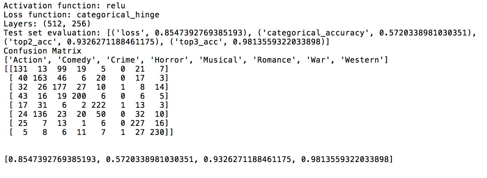

# Movie Genre Prediction

## Dataset

Dataset is comprised of 8 different movie genres (Action, Comedy, Crime, Horror, Musical, Romance, War and Western). There are 5528 training instance (691 per class) and 2368 test instances (296 per class). If you wish to download the dataset, please send an (informal) email.

## Usage

#### Setting Configurations
* After preprocessing the raw dataset, the path of the preprocessed dataset should be given [here](https://github.com/ugurduzel/Movie-Genre-Prediction/blob/4e09f3bb25c7d61ad16b2dd25876ed6afeb1a925/config.py#L7).
* Minumum and maximum document frequencies can be given [here](https://github.com/ugurduzel/Movie-Genre-Prediction/blob/4e09f3bb25c7d61ad16b2dd25876ed6afeb1a925/config.py#L12) in order to play with the feature vector's size.
* For now there are only 3 bag of words (existence, count and tf-idf) approaches for feature extraction which should be given [here](https://github.com/ugurduzel/Movie-Genre-Prediction/blob/4e09f3bb25c7d61ad16b2dd25876ed6afeb1a925/config.py#L23). 
#### Training
* After adjusting the [config.py](config.py) file, running main.py will be enough. 
* To print the output of the training process, set verbose to 1 [here](https://github.com/ugurduzel/Movie-Genre-Prediction/blob/4e09f3bb25c7d61ad16b2dd25876ed6afeb1a925/ExperimentSuite.py#L52).

## Evaluation

* Categorical, Top-2 and Top-3 Accuracies were used but any other other performance metric you wish to add can be given [here](https://github.com/ugurduzel/Movie-Genre-Prediction/blob/c4f4d767c171925ddcc07cdb03cbd29ec05863be/ExperimentSuite.py#L19).
* The output format will be like the following image. 

